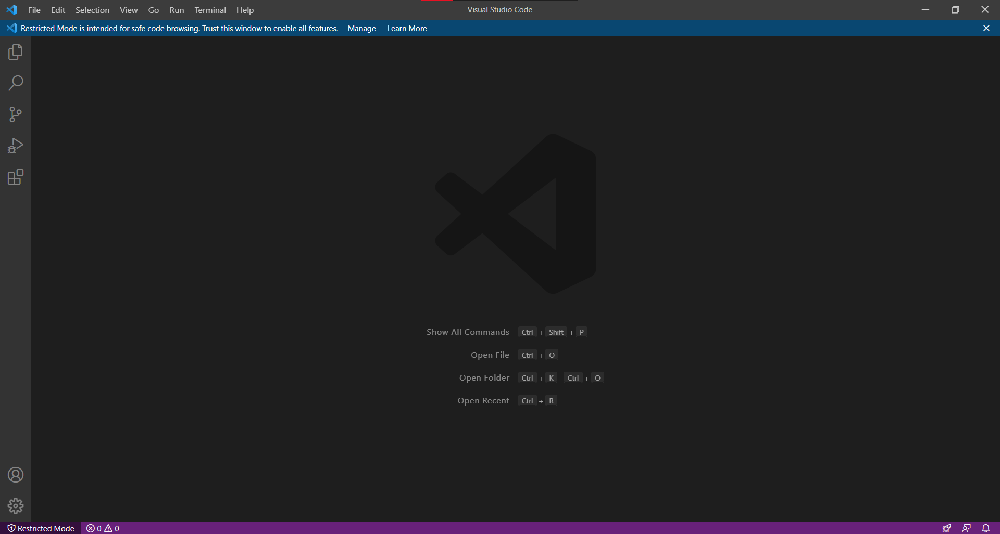
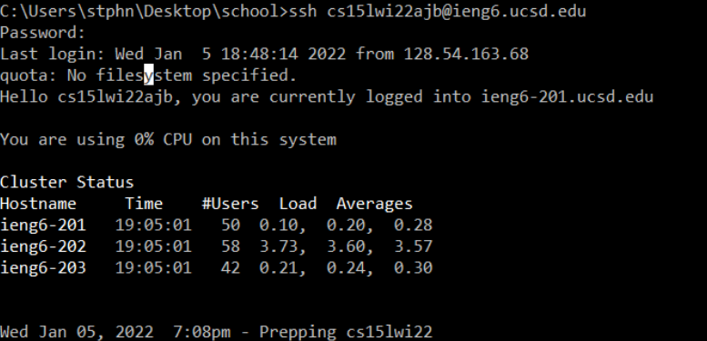
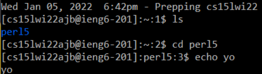
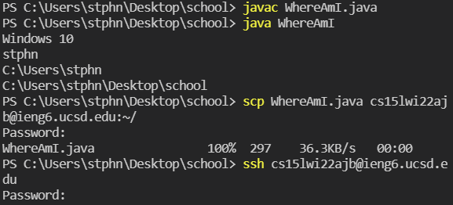
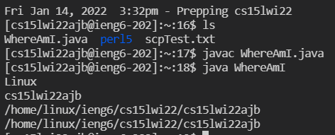
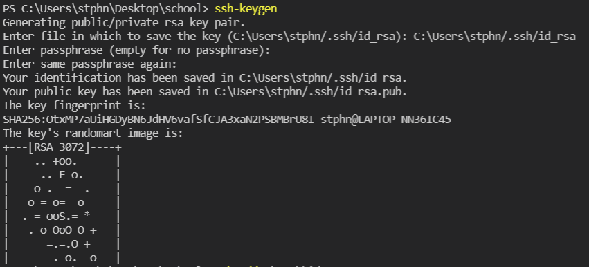
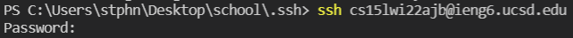
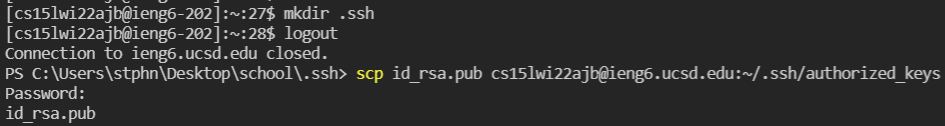
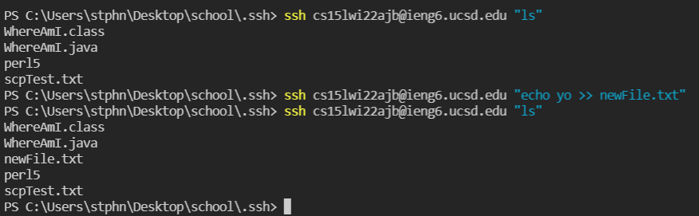

# Week 1 CSE 15L Instructions

## Step 1: Install VSCode

First install VSCode from [here](https://code.visualstudio.com/). Click download and follow installation instrucions from there. Once it is set up, open VSCode, which should look like this: 

## Step 2: Remotely Connecting

Next open the command line. On windows, you do this by clicking the start icon or "Type here to search" and then typing "Command Prompt" and double clicking the Command Prompt Application. Then, type the command `ssh cs15lwi22ajb@ieng6.ucsd.edu`. You may need to change the address if you are connecting to a different server than me. If you are another student, the `ajb` will change to something else. Then type in your ucsd password. Note that you won't be able to see what you type the screen will not change at all when you do this. After you're done, it should look like this:

## Step 3: Try using commands remotely!

Next, make sure your remote connection is working properly by testing out standard commands on the remote machine, maybe some `ls`s and `cd`s and `echo`s. This is what I did:

## Step 4: Moving files between local and remote machines with scp

It is important to be able to move files from a local location to a remote machine, which is where the `scp` command comes in. `WhereAmI.java` is a script that prints information about the file path and system that the file is being run on, so we'll use it to test `scp`. The syntax for the command is `scp` then the name of the file to be moved then the address followed immediately by `:~/`. It should look like this:

## Step 5: SSH keys

Now, typing in your password every time you want to connect to a remote machine or move a file to a remote machine might be a pain, especially if you have to do it often, so we can avoid that with SSH keys. Follow the following steps to set them up:

## Step 6: Remote Running Optimization

`ssh`ing into the remote machine, running a single command then logging out might be too much of a hassle for one or two commands. So, you can add your command you want to run by adding it on to your `ssh` command and it will run it on the remote machine. You can run more than one command in one line by separating them with semicolons

