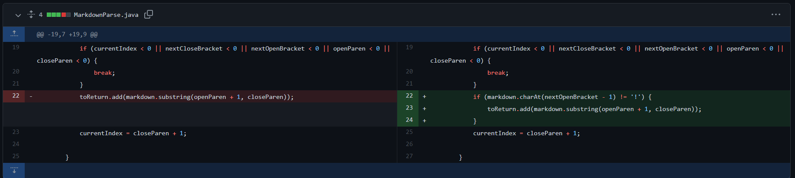
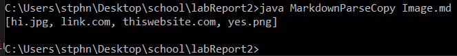
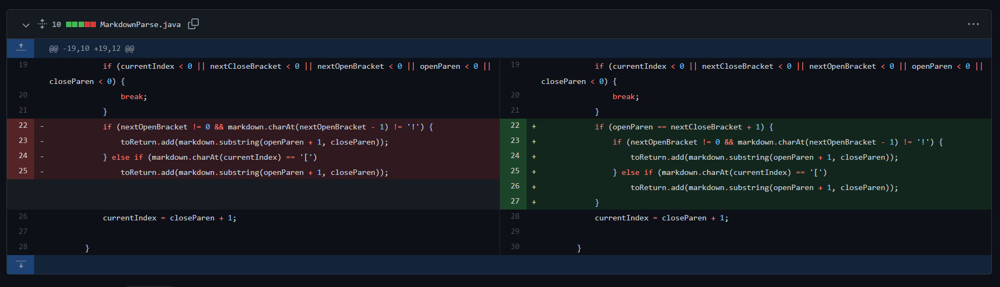
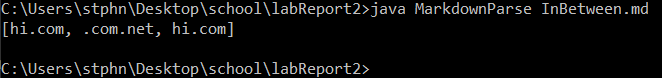
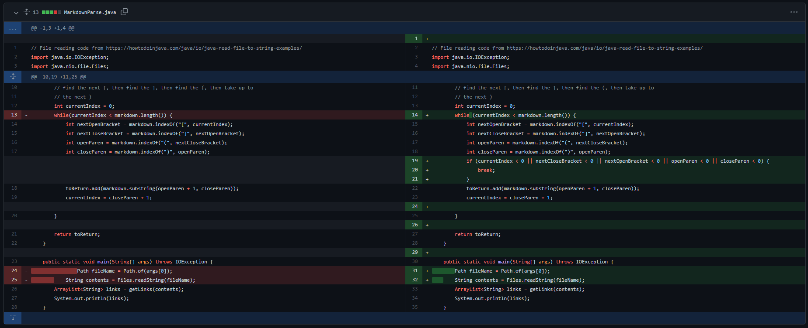
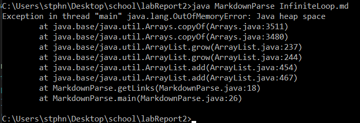

# Lab Report 2 Week 4

## Code Change 1

[failure-inducing input](https://github.com/Stephen-Schuster/markdown-parse/blob/main/Image.md)

The bug was that the code made no attempt to distinguish links from images because it did not look for `!` at all. This had the effect(the symptom) of listing image names as if they were links. So all we had to do to fix this was simply check to see if there was a `!` before the `[` and only add the link if there was no such `!`

## Code Change 2

[failure-inducing input](https://github.com/Stephen-Schuster/markdown-parse/blob/main/InBetween.md)

The bug was that the code did not check to make sure that there was no space between the `]` and `(`. The symptom of this was that it would count things as links if there was stuff between a set of brackets and a `(`, which it shouldn't. To combat this we checked to make sure that the character richt after the `]` was a `(` before we added each link.

## Code Change 3

Note: There's a lot of formatting changes in this commit, but the important part is lines 19, 20 and 21

[failure-inducing input](https://github.com/Stephen-Schuster/markdown-parse/blob/main/InfiniteLoop.md)

The bug was that if any of `nextCloseBracket`, `nextOpenBracket`, `openParen`, or `closeParen` were -1(meaning there were none left in the line). One symptom(of many) of this bug was that when any line in the input did not end with a `)`, an infinite loop happened because if a `)` was not found, `closeParen` would be -1 and then `currentIndex` would be `closeParen + 1` which is equal to 0, so it would start over from the beginning of the line and do that indefinitely. The solution was to break the loop if any of  `nextCloseBracket`, `nextOpenBracket`, `openParen`, or `closeParen` were -1.
