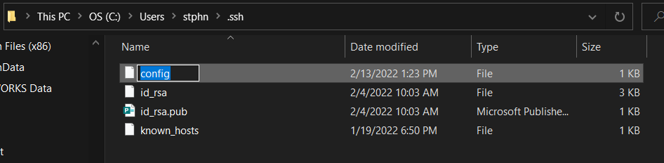
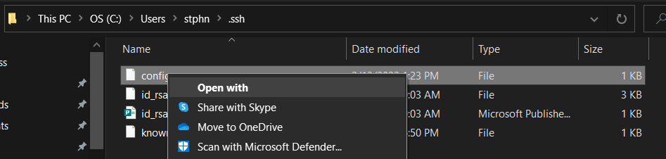
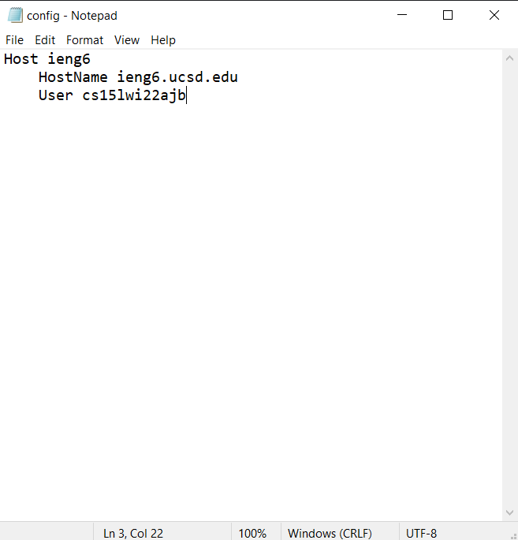

# Lab Report 3, Week 6
First, I created a new file in my `~/.ssh` directory and named it `config`
 
Second, I hit `Open With` -> Notepad and copy/pasted in the text. I'll just use `ieng6` as the alias; it's probably the shortest thing that makes sense
  
And, for the first time in way too long, a tutorial worked perfectly as expected on the first try. Here's me `ssh`ing into the server, seeing that there is no fox image and then using `scp` to copy one over.
 
