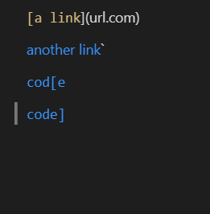
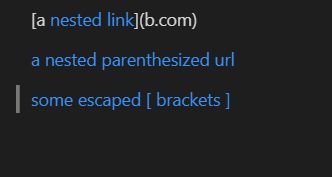
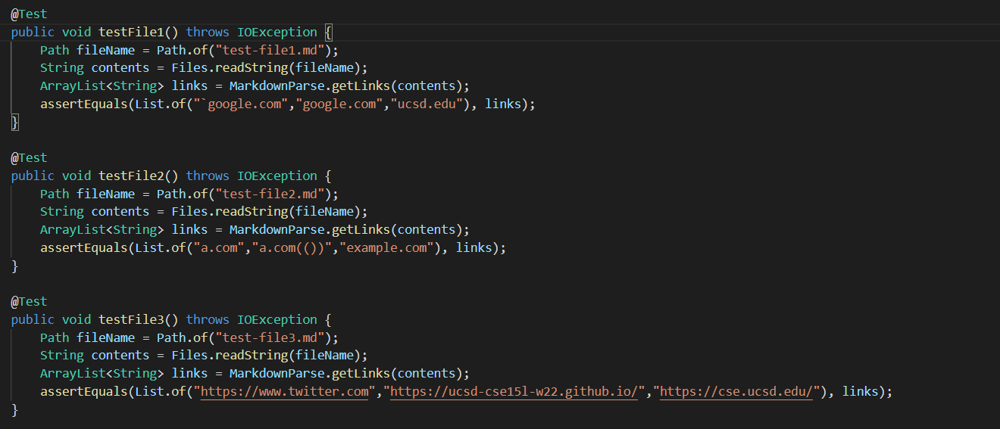

# [Repository Link](https://github.com/Stephen-Schuster/markdown-parse)

# Here is what the snippets *should* produce:

## Snippet 1:

 

Links: `` `google.com``, `google.com`, `ucsd.edu`

## Snippet 2:

 

Links: `a.com`, `a.com(())`, `example.com`

## Snippet 3:

 

Links: `https://www.twitter.com`, `https://ucsd-cse15l-w22.github.io/`, `https://cse.ucsd.edu/`

Here are the tests I added for the implementation I reviewed:

 

Here are the tests I added for our implementation:

 
