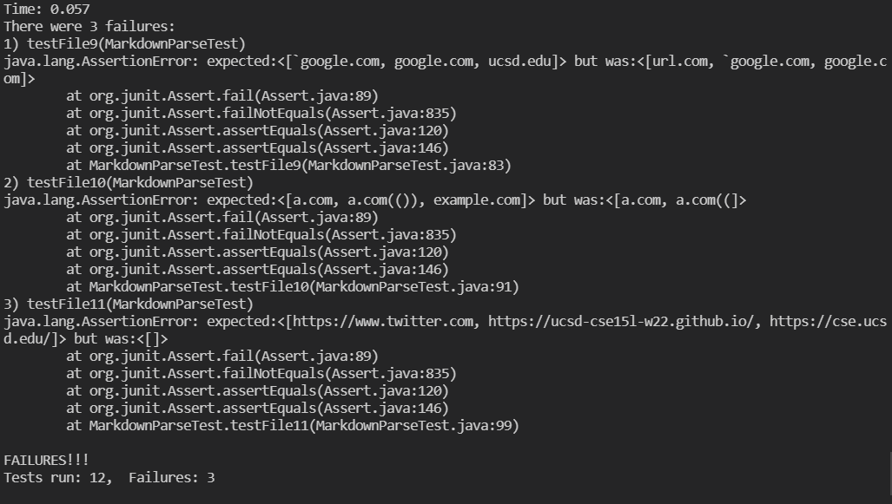

# [Repository Link](https://github.com/Stephen-Schuster/markdown-parse)

# Here is what the snippets *should* produce:

## Snippet 1:

 

Links: `` `google.com``, `google.com`, `ucsd.edu`

## Snippet 2:

 

Links: `a.com`, `a.com(())`, `example.com`

## Snippet 3:

 

Links: `https://www.twitter.com`, `https://ucsd-cse15l-w22.github.io/`, `https://cse.ucsd.edu/`

Here are the tests I added for our implementation:

 

Here are the tests I added for the implementation we reviewed:

 

Here are the JUnit Tests for being run for our implementation: 

Here are the JUnit Tests for being run for the implementation we reviewed: 

## Snippet 1 fix

We could fix it by adding a while loop at the beginning of the `while (currentIndex < markdown.length())` loop that checks if there is a `` ` `` before the next `[` and updating `currentIndex` to after the closing backtick until there are not backticks between `currentIndex` and the next `[`. Then we do the same for `]` after we find the `[`.

## Snippet 2 fix

We could fix it by not ending the link until *ALL* `(` have a corresponding `)`. So we have a variable that says how many open parentheses exist without close parentheses at `currentIndex`. If there is a `(` before the next `)` we increase that counter, otherwise we decrease it. We keep updating the `currentIndex` to after the next `(` or `)` until all parentheses have been closed(aka that variable is 0) and we include that whole thing in the link. We also need to check to make sure there is no `\` before the `]`.

## Snippet 3 fix

First we need to call `.trim()` on the link before we check if we should add it. Then when we check to see if we can add the link, we need to only add the link if there is no white space in it. If there is whitespace, set `currentIndex` to the index of that whitespace
