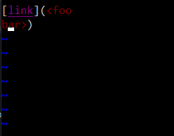

# [Repository Link](https://github.com/Stephen-Schuster/markdown-parse)

# Finding test cases with different results

First, I modified the bash script to print the name of the file before printing the output

Then, I ran the bash script, redirecting the output to a file called `output.txt` for both my group's implementation and the provided implementation.

Finally, I ran `diff` on the 2 output files. I looked at the line numbers being compared and went into the output files to see which tests gave different results

# Test difference 1: 577

One test case with different results was `577.md`, which has the following contents: 

The provided implementation listed `train.jpg` when it shouldn't be because the open bracket is preceeded by a `!`. My implementation does not list `train.jpg` as a link for this reason. All you have to do to fix this is check to make sure the character before the open bracket is not a `!` before adding a link.

# Test difference 2: 490

Another test case with different results was `490.md`, which has the following contents: 

My implementation incorrectly listed `<foo\nbar>` as a link when it shouldn't be because links interrupted by line breaks do not count as links. The provided implementation does not list `<foo\nbar>` as a link for this reason. To fix this, I should check to make sure there are not line breaks in the middle of the link before adding it as a link.
