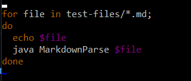
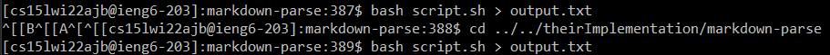
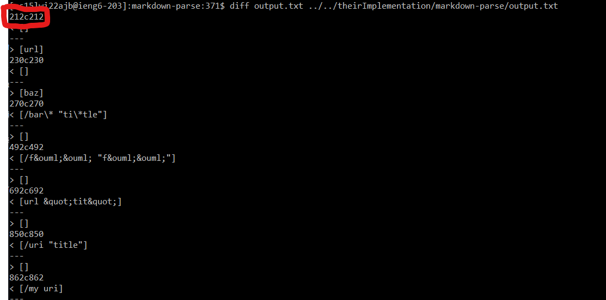
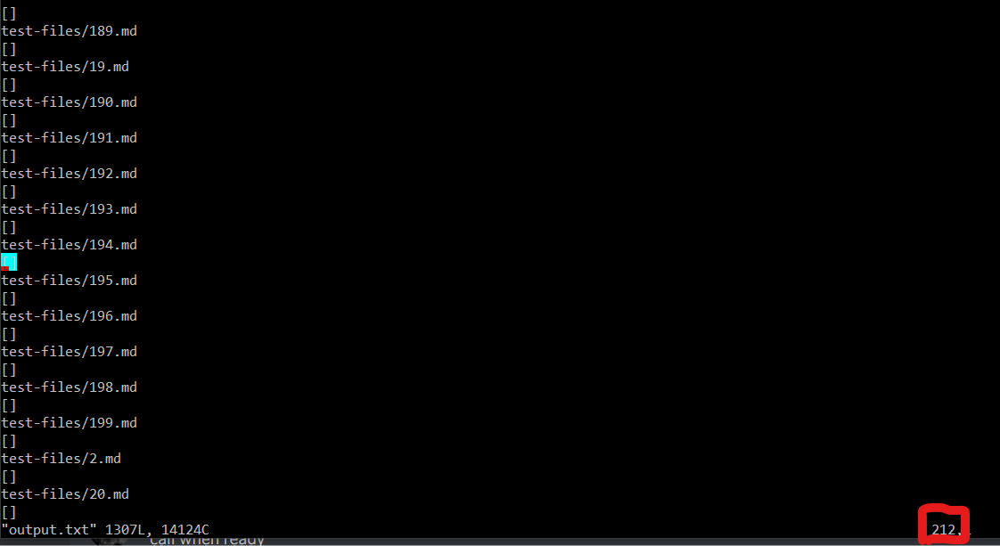
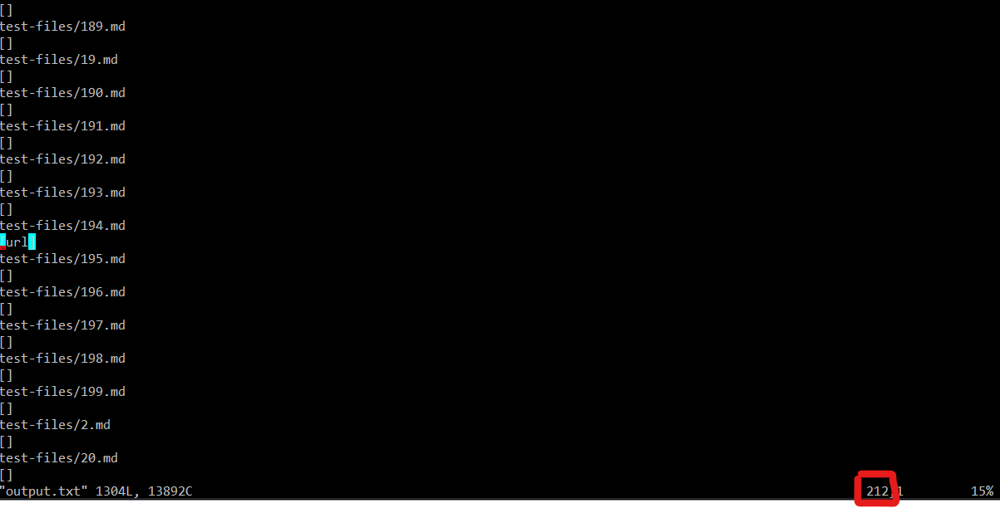
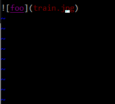

# [Repository Link](https://github.com/Stephen-Schuster/markdown-parse)

# Finding test cases with different results

First, I modified the bash script to print the name of the file before printing the output

Then, I ran the bash script, redirecting the output to a file called `output.txt` for both my group's implementation and the provided implementation.

Finally, I ran diff on the 2 output files. I looked at the line numbers being compared and went into the output files to see which tests gave different results

# Test difference 1: 194

The difference on line 212 was for test file `194.md` which has these contents:

[foo](/bar* "ti*tle")
