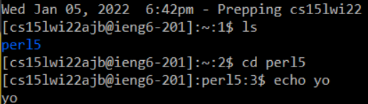
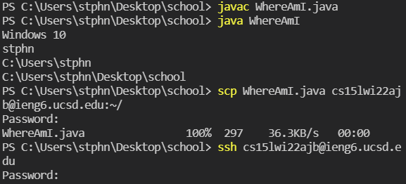
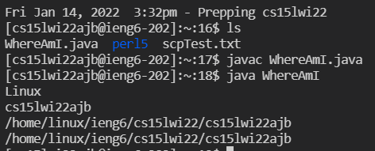
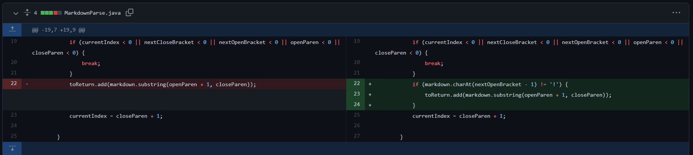
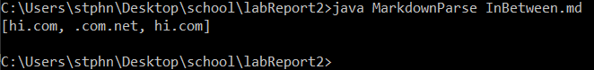
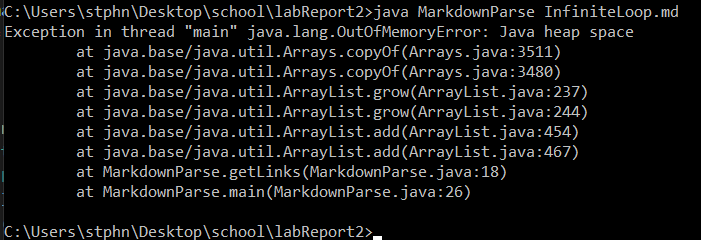
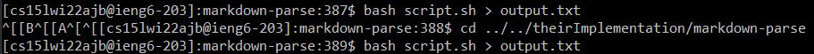
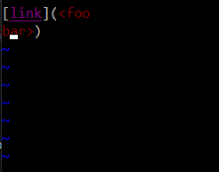
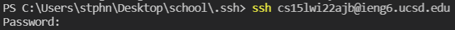

# **CSE 15L LAB REPORTS**
# Lab Report 1 Week 2

## Step 1: Install VSCode

First install VSCode from [here](https://code.visualstudio.com/). Click download and follow installation instrucions from there. Once it is set up, open VSCode, which should look like this: 

## Step 2: Remotely Connecting

Next open the command line. On windows, you do this by clicking the start icon or "Type here to search" and then typing "Command Prompt" and double clicking the Command Prompt Application. Then, type the command `ssh cs15lwi22ajb@ieng6.ucsd.edu`. You may need to change the address if you are connecting to a different server than me. If you are another student, the `ajb` will change to something else. Then type in your ucsd password. Note that you won't be able to see what you type the screen will not change at all when you do this. After you're done, it should look like this:

## Step 3: Try using commands remotely!

Next, make sure your remote connection is working properly by testing out standard commands on the remote machine, maybe some `ls`s and `cd`s and `echo`s. This is what I did:

## Step 4: Moving files between local and remote machines with scp

It is important to be able to move files from a local location to a remote machine, which is where the `scp` command comes in. `WhereAmI.java` is a script that prints information about the file path and system that the file is being run on, so we'll use it to test `scp`. The syntax for the command is `scp` then the name of the file to be moved then the address followed immediately by `:~/`. It should look like this:

# Lab Report 2 Week 4

## Code Change 1

[failure-inducing input](https://github.com/Stephen-Schuster/markdown-parse/blob/main/Image.md) ([raw](https://raw.githubusercontent.com/Stephen-Schuster/markdown-parse/main/Image.md))

The bug was that the code made no attempt to distinguish links from images because it did not look for `!` at all. This had the effect(the symptom) of listing image names as if they were links. So all we had to do to fix this was simply check to see if there was a `!` before the `[` and only add the link if there was no such `!`

## Code Change 2

[failure-inducing input](https://github.com/Stephen-Schuster/markdown-parse/blob/main/InBetween.md) ([raw](https://raw.githubusercontent.com/Stephen-Schuster/markdown-parse/main/InBetween.md))

The bug was that the code did not check to make sure that there was no space between the `]` and `(`. The symptom of this was that it would count things as links if there was stuff between a set of brackets and a `(`, which it shouldn't. To combat this we checked to make sure that the character richt after the `]` was a `(` before we added each link.

## Code Change 3

Note: There's a lot of formatting changes in this commit, but the important part is lines 19, 20 and 21

[failure-inducing input](https://github.com/Stephen-Schuster/markdown-parse/blob/main/InfiniteLoop.md) ([raw](https://raw.githubusercontent.com/Stephen-Schuster/markdown-parse/main/InfiniteLoop.md))

The bug was that if any of `nextCloseBracket`, `nextOpenBracket`, `openParen`, or `closeParen` were -1(meaning there were none left in the line). One symptom(of many) of this bug was that when any line in the input did not end with a `)`, an infinite loop happened because if a `)` was not found, `closeParen` would be -1 and then `currentIndex` would be `closeParen + 1` which is equal to 0, so it would start over from the beginning of the line and do that indefinitely. The solution was to break the loop if any of  `nextCloseBracket`, `nextOpenBracket`, `openParen`, or `closeParen` were -1.

# Lab Report 3 Week 6
First, I created a new file in my `~/.ssh` directory and named it `config`

 

Second, I hit `Open With` -> Notepad and copy/pasted in the text. I'll just use `ieng6` as the alias; it's probably the shortest thing that makes sense

 
 

And, for the first time in way too long, a tutorial worked perfectly as expected on the first try. Here's me `ssh`ing into the server, seeing that there is no fox image and then using `scp` to copy one over.

 

# Lab Report 4 Week 8

# [Repository Link](https://github.com/Stephen-Schuster/markdown-parse)

# Here is what the snippets *should* produce:

## Snippet 1:

 

Links: `` `google.com``, `google.com`, `ucsd.edu`

## Snippet 2:

 

Links: `a.com`, `a.com(())`, `example.com`

## Snippet 3:

 

Links: `https://www.twitter.com`, `https://ucsd-cse15l-w22.github.io/`, `https://cse.ucsd.edu/`

Here are the tests I added for our implementation:

 

Here are the tests I added for the implementation we reviewed:

 

Here are the JUnit Tests for being run for our implementation: 

Here are the JUnit Tests for being run for the implementation we reviewed: 

## Snippet 1 fix

We could fix it by adding a while loop at the beginning of the `while (currentIndex < markdown.length())` loop that checks if there is a `` ` `` before the next `[` and updating `currentIndex` to after the closing backtick until there are no backticks between `currentIndex` and the next `[`. Then we do the same for `]` after we find the `[`.

## Snippet 2 fix

We could fix it by not ending the link until *ALL* `(` have a corresponding `)`. So we have a variable that says how many open parentheses exist without close parentheses at `currentIndex`. If there is a `(` before the next `)` we increase that counter, otherwise we decrease it. We keep updating the `currentIndex` to after the next `(` or `)` until all parentheses have been closed(aka that variable is 0) and we include that whole thing in the link. We also need to check to make sure there is no `\` before the `]`.

## Snippet 3 fix

First we need to call `.trim()` on the link before we check if we should add it. Then when we check to see if we can add the link, we need to only add the link if there is no white space in it. If there is whitespace, set `currentIndex` to the index of that whitespace

# CSE 15L Lab Report 5 Week 10

## [Repository Link](https://github.com/Stephen-Schuster/markdown-parse)

## Finding test cases with different results

First, I modified the bash script to print the name of the file before printing the output

Then, I ran the bash script, redirecting the output to a file called `output.txt` for both my group's implementation and the provided implementation.

Finally, I ran `diff` on the 2 output files. I looked at the line numbers being compared and went into the output files to see which tests gave different results

## Test difference 1: 577

One test case with different results was `577.md`, which has the following contents: 

The provided implementation listed `train.jpg` when it shouldn't be because the open bracket is preceeded by a `!`. My implementation does not list `train.jpg` as a link for this reason. All you have to do to fix this is check to make sure the character before the open bracket is not a `!` before adding a link.

# Test difference 2: 490

Another test case with different results was `490.md`, which has the following contents: 

My implementation incorrectly listed `<foo\nbar>` as a link when it shouldn't be because links interrupted by line breaks do not count as links. The provided implementation does not list `<foo\nbar>` as a link for this reason. To fix this, I should check to make sure there are not line breaks in the middle of the link before adding it as a link.

## Step 5: SSH keys

Now, typing in your password every time you want to connect to a remote machine or move a file to a remote machine might be a pain, especially if you have to do it often, so we can avoid that with SSH keys. Follow the following steps to set them up:

## Step 6: Remote Running Optimization

`ssh`ing into the remote machine, running a single command then logging out might be too much of a hassle for one or two commands. So, you can add your command you want to run by adding it on to your `ssh` command and it will run it on the remote machine. 

You can run more than one command in one line by separating them with semicolons. Here is an instance of me doing that. First I `ls` all the files in the remote machines current directory, then I print what is currently in the `newFile.txt` file, then I add a new line to that file and print its contents again, all in 1 line

Let's say I copied `WhereAmI.java` to the remote machine, compiled and ran it remotely with `ssh cs15lwi22ajb@ieng6.ucsd.edu "javac WhereAmI.java;java WhereAmI"` and made edits to the file *locally*. How many keystrokes will it take to copy those edits to `WhereAmI.java` on the server and run it with those changes? You only need 7 keystrokes:
1) Click on the terminal to bring it back into focus
2) Hit up arrow
3) Use up arrow again to get back to the `scp WhereAmI.java cs15lwi22ajb@ieng6.ucsd.edu:~/` command
4) Hit enter to run it
5) Hit up arrow
6) Use up arrow again to get back to the `ssh cs15lwi22ajb@ieng6.ucsd.edu "javac WhereAmI.java;java WhereAmI"` command
7) Hit enter to run it

And that's it. Just 7 keystrokes to copy, compile and run local changes on a remote machine.

For reference, the highlighted text in the following screenshot is the local change I made to `WhereAmI.java`

